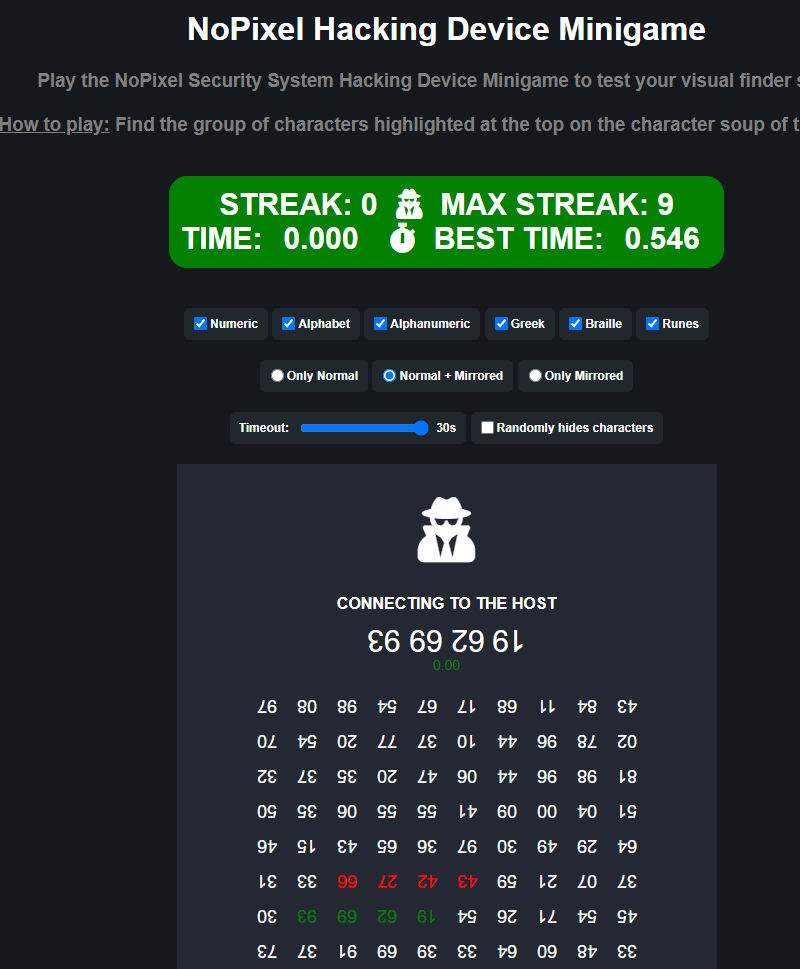

# NoPixel_Hacking_Device_Bot
Script that uses computer vision to do hacking device minigame for you

## Dependencies

1. Everything in the [requirements.txt](requirements.txt)

## Usage
``` python NoPixel_Hacking_Device_Bot.py```

## Config

You will have to update the zone for your screen resolution
```
zone = {"left": 682, "top": 474, "width": 540, "height": 534}
```

Tested on https://sharkiller.ddns.net/nopixel_minigame/hackingdevice/
Hasn't been adjusted for in game use

